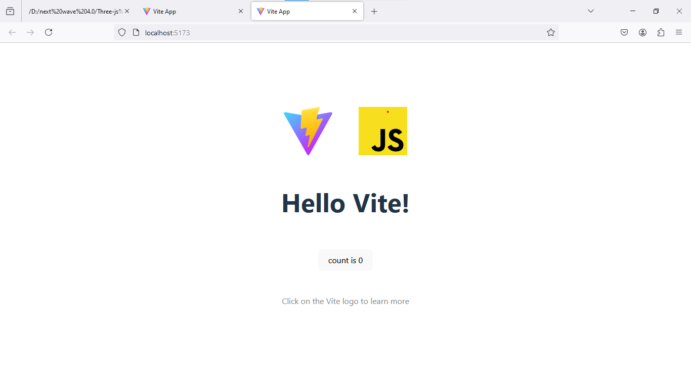
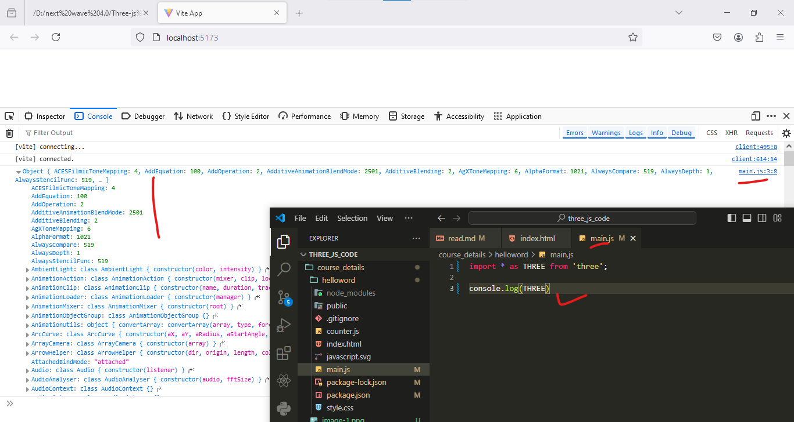

## creating the hellow word program using the three-js 
1) step-1-1: npm create vite@latest
2) step-1.2: √ Project name: ... helloword
3) step-1.3:  Select a framework: » Vanilla
4) step-1.4:  Select a variant: » JavaScript
5) step-1.5:  cd helloword
6) step-1.6:  npm install
7) step-1.7:  npm run dev
8) output is -----------

## --------------------- install ---------------------------------------
9) npm install --save three
10) npm install --save-dev vite
11) 
12) 
